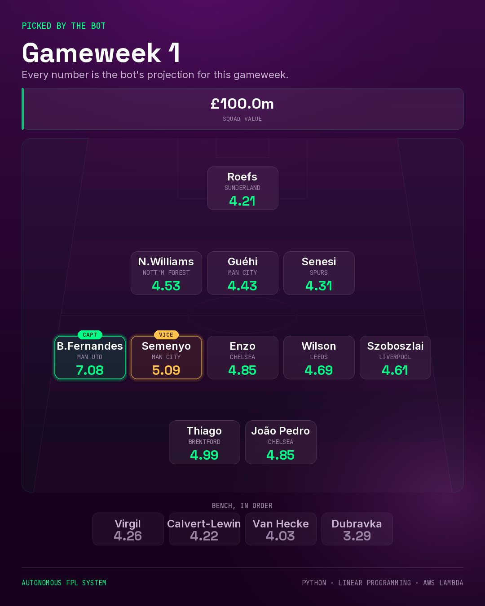

# FPL Bot

An autonomous Fantasy Premier League manager. It scores every player in the
game, decides transfers, picks the starting XI and captain, submits all of it,
and emails an explanation of why.

It runs unattended on AWS Lambda. When it can't sign in to FPL, it doesn't
fail — it emails the same decisions for you to apply by hand.

<p align="center">
  
</p>

---

## What it does

Every two hours it wakes up, checks how close the deadline is, and goes back to
sleep unless it's within five hours — late enough that the Friday press
conferences are already out.

When it does act:

1. Rates all ~570 players on expected points per fixture
2. Checks current team news for anything the data can't show
3. Plans transfers, chaining up to five while each clears a threshold
4. Picks the best legal XI, captain, vice-captain and bench order
5. Flags any chip worth considering — never plays one
6. Submits everything, then emails the reasoning with a shareable squad image

---

## The interesting parts

**Two scores, not one.** Who you *own* is a five-gameweek question, because
transfers are scarce and a player is bought for a run of fixtures. Who *starts*
is a this-week question. A single number can't answer both — weight it forward
and captaincy suffers, weight it on this week and transfers become
short-sighted. So the bot computes both.

**The model is backtested, not assumed.** Player scoring is a regression on
points, expected goal involvement and ICT per 90 minutes, fitted on 874
player-season pairs from 2009 onwards. Out-of-sample correlation with
next-season output went from 0.30 to 0.49 against a points-only baseline.

**It degrades instead of failing.** FPL retired the login endpoint this project
depended on, mid-build. Rather than patch around it, the system was rebuilt so
that being unable to sign in produces a different outcome, not a failed one.
Same for the optimiser: no linear programming layer means a pure-Python
fallback within about 1% of optimal, with a line in the log saying so.

**The LLM only ever lowers a rating.** Team news — rotation, a manager resting
someone, a signing short of match fitness — is read by Claude with web search.
It can reduce a player's projection, never raise it, so a wrong call costs at
most one player rather than talking the bot into a bad buy. It runs in shadow
mode until its judgement has been checked against a few gameweeks.

---

## Stack

Python · pandas · PuLP (linear programming) · Pillow · AWS Lambda ·
EventBridge · SSM Parameter Store · Claude API with web search

---

## Setup

See [SETUP.md](SETUP.md) — layers, environment variables, IAM, schedule, and
the one recurring manual step.

Short version: create three Lambda layers, set `FPL_TEAM_ID`, paste
`fpl_bot_hybrid.py` into the function, and point EventBridge at it.

---

## Repository

```
fpl_bot_hybrid.py          the bot
fpl_bot_hybrid_DRYRUN.py   same code, submits nothing — for testing
SETUP.md                   deployment guide
HOW_IT_WORKS.md            the modelling and design decisions
collect_preseason.py       one-off data collection, already run
collect_established.py     one-off data collection, already run
layers/                    prebuilt Lambda layers
```

---

## What it deliberately doesn't do

- **Play chips.** Wildcard, Free Hit, Bench Boost and Triple Captain are
  one-shot decisions worth too much to hand to a threshold. The bot flags them.
- **Model price changes.** Not attempted.
- **Value volatility.** It scores averages, so it can't distinguish a reliable
  six from an explosive one — which is exactly the difference that wins a
  gameweek. This is the largest known gap.
- **Plan beyond five gameweeks.** The horizon is a tunable constant.

---

## A note on the FPL API

It's unofficial. No contract, no versioning, no notice of change — as the login
removal demonstrated mid-project. Every call goes through a wrapper that checks
the status code and content type before parsing, retries with backoff, and logs
what actually came back rather than a `JSONDecodeError` pointing at character
zero.

---

## Licence

MIT. Not affiliated with the Premier League or Fantasy Premier League.
