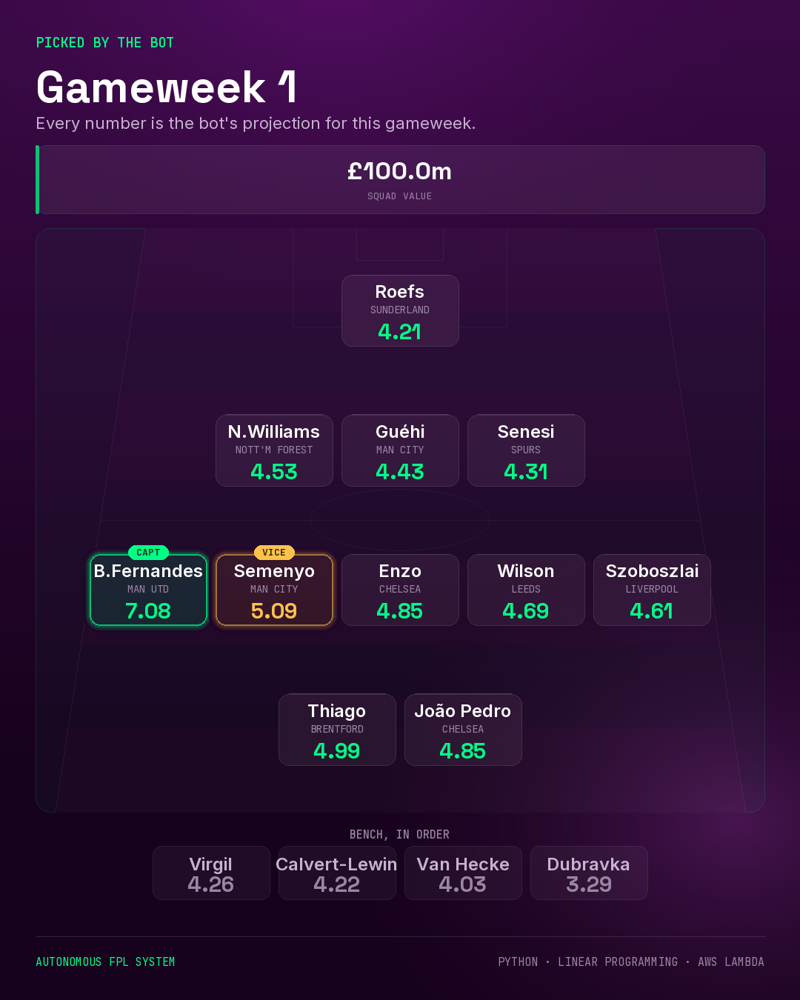

# FPL Bot

An autonomous Fantasy Premier League manager. It scores every player in the
game, plans transfers, picks the starting XI and captain, decides when to play
chips, submits all of it, emails an explanation of why — and publishes every
prediction before kickoff so the model can be marked in public.

It runs unattended on AWS Lambda, entirely on free tiers. When it can't sign in
to FPL, it doesn't fail — it emails the same decisions for you to apply by hand.

**→ [Live results](https://shanbhag003.github.io/fpl-auto-manager/)**

<p align="center">
  
</p>

---

## What it does

Every two hours it wakes up, checks how close the deadline is, and goes back to
sleep unless it's within five hours — late enough that the Friday press
conferences are already out.

When it does act:

1. Rates all ~600 players on expected points, for this week and for the next five
2. Reads the last four days of injury and team-news headlines for its squad's
   clubs, and lowers the rating of anyone they flag
3. Plans every transfer in one optimisation: the best XI and captain over five
   weeks, minus hits, weighed against saving the free transfers
4. Picks the best legal XI, captain, vice-captain and bench order
5. Plays a chip when its projected gain clears a backtested threshold, and uses
   up any chip before its window closes
6. Submits everything, then emails the reasoning with a shareable squad image
7. Commits its projection for every player in the game, before a ball is kicked

A second job runs every six hours and fills in what actually happened, so the
site shows live scores during a gameweek rather than waiting for it to end.

---

## The interesting parts

**Every decision rule was replayed over past seasons first.**
[`backtest/`](backtest/) rebuilds 2023-24 to 2025-26 gameweek by gameweek from
what was known at each deadline, then plays them with the bot's own decision
functions. It scores them as FPL does, including auto-subs, selling prices,
the five-transfer bank and hits. Over those three seasons:

| Setup | Points per season |
|---|---|
| The bot as it ran GW1–5 of 2026-27 | 1,445 |
| + transfers chosen in one optimisation | 1,765 |
| + start probability measured per match played | 2,234 |
| + chips played at backtested thresholds | 2,407 |

The simulator can't see FPL's injury flags, so the absolute totals run low. The
gaps between rows are the point. The same backtest also ruled things *out*.
Five LightGBM variants were better calibrated than the hand-built formula but
worse at ranking the players you'd actually captain (6.6–6.9 vs 7.7 points a
week), so the formula stays. Sweeping the optimiser's constants showed only
noise, so they stay too.

**Two scores, not one.** Who you *own* is a five-gameweek question, because
transfers are scarce and a player is bought for a run of fixtures. Who *starts*
is a this-week question. A single number can't answer both — weight it forward
and captaincy suffers, weight it on this week and transfers become
short-sighted. So the bot computes both.

**Transfers are one optimisation, not a chain of swaps.** A mixed-integer
program (PuLP/CBC, ~2 seconds) picks the new fifteen to maximise what FPL
actually scores: the XI and captain this week plus the decayed next four, with
the bench at a tenth. Each hit costs 4 points plus a 2-point margin, and each
free transfer carried over is worth 2, up to FPL's cap of five. Doing nothing is
always an option, so it only transfers when the whole plan beats holding.

**Chips are played, not just flagged.** Each week it projects what every
available chip would add:

| Chip | Measured as | Plays at |
|---|---|---|
| Triple Captain | the captain's score | 9 |
| Bench Boost | the bench's score | 13.3 |
| Free Hit | the one-week squad over the planned one | +6 |
| Wildcard | the rebuild over the transfer plan, five weeks | +13.5 |

Those thresholds sit where the simulator scored best. Playing too eagerly
wasted chips on ordinary weeks, and playing too selectively left them to be
forced at the deadline. Anything unused as a window closes is played rather
than lost.

**The model is backtested, not assumed.** Player quality is a regression on
points, expected goal involvement and ICT per 90 minutes, fitted on 874
player-season pairs from 2009 onwards (out-of-sample R² 0.368 vs 0.302 for
points alone). Start probability is starts per match the player could have
started. It used to be starts over a full 34-game season, which at GW10 rated an
ever-present starter as a 29% one. Fixing that was the single biggest gain the
simulator found.

**Team news can only lower a rating.** For each club in the squad, the bot
pulls the last four days of injury and team-news headlines from Google News,
and Gemini (free tier) reads them and returns a minutes risk per player. It is
told to use only those headlines. It can reduce a projection, by at most 75%,
never raise one, and it rejects claims that contradict a player's record. When
FPL already flags the same injury, the lower of the two estimates is used
rather than both. In its first live check it caught two injuries FPL hadn't
flagged yet.

**The predictions are published before kickoff, and can't be edited after.**
Every gameweek, a projection for every player is committed to this repository
before the deadline, and the file is never rewritten. The commit timestamp is
the proof. That's what makes the comparison on the site mean anything —
including against a hand-picked human team whose squad isn't even public until
after the deadline.

**It degrades instead of failing.** FPL retired the login endpoint this project
depended on, mid-build. Rather than patch around it, the system was rebuilt so
that being unable to sign in produces a different outcome, not a failed one.
The same principle applies everywhere else:

- No optimiser layer: a pure-Python fallback within about 1% of optimal.
- Gemini busy or out of quota: the next model is tried.
- No news at all: the week goes ahead without it.
- GitHub outage: it costs a chart, never a gameweek.

---

## Stack

Python · pandas · PuLP (mixed-integer programming) · Pillow · AWS Lambda ·
EventBridge · SSM Parameter Store · Gemini API (free tier) · Google News RSS ·
GitHub Pages · GitHub Actions (OIDC deploys) · LightGBM (backtest only)

Everything runs on free tiers. The front end is one HTML file with no build
step and no dependencies beyond three web fonts. It reads a single JSON file.

---

## Setup and deploys

See [SETUP.md](SETUP.md) — layers, environment variables, IAM, schedule, and
the one recurring manual step: refreshing `FPL_TOKEN` on deadline day.

Code reaches Lambda through GitHub, not the console. Merging a change to
`fpl_bot_hybrid.py` or `fpl_results.py` into `main` runs the **Deploy Lambda**
workflow. It signs in to AWS with a short-lived OIDC token (no stored keys),
replaces only the handler file, and refuses to overwrite code that was edited in
the console. [LAMBDA_DEPLOY.md](LAMBDA_DEPLOY.md) has the one-time AWS setup.

---

## Repository

```
fpl_bot_hybrid.py          the bot (Lambda: fpl-auto-manager)
fpl_results.py             fills in actual points; second Lambda (fpl-results), every 6h
index.html                 the public site, served by GitHub Pages
data/season.json           every gameweek: squads, projections, results
data/projections/          per-gameweek projections, write-once
backtest/                  replays past seasons: model comparison, tuning, season simulator
tools/check_news.py        runs the team-news check locally on the squad
make_card.py               renders a gameweek share card (Share card workflow)
.github/workflows/         Deploy Lambda, Lambda snapshot, Share card, Seed GW1
SETUP.md                   deployment guide for the bot
LAMBDA_DEPLOY.md           GitHub → Lambda deploys and their AWS setup
HOW_IT_WORKS.md            the modelling and design decisions
collect_preseason.py       one-off data collection, already run
collect_established.py     one-off data collection, already run
seed_gw1.py                one-off, already run — see below
fpl_bot_hybrid_DRYRUN.py   an old hand-made dry-run copy, now out of date; use test_mode
```

`seed_gw1.py` exists because the publishing layer was built after GW1 had been
played. It transcribes that gameweek's projections from the emailed poster,
which predates kickoff, rather than recomputing them from data that now includes
the results. It is hardcoded to GW1 and should not be run again.

---

## What it deliberately doesn't do

- **Model price changes.** Not attempted.
- **Value volatility.** It scores averages, so it can't distinguish a reliable
  six from an explosive one — which is exactly the difference that wins a
  gameweek. This is the largest known gap.
- **Plan beyond five gameweeks.** The horizon is a tunable constant.
- **Rewrite history.** A published projection is never edited, and a gameweek
  marked final is never touched again.

---

## A note on the FPL API

It's unofficial. No contract, no versioning, no notice of change — as the login
removal demonstrated mid-project. Every call goes through a wrapper that checks
the status code and content type before parsing, retries with backoff, and logs
what actually came back rather than a `JSONDecodeError` pointing at character
zero.

Two flags in particular are worth knowing about. `finished` on a gameweek flips
at the final whistle, but bonus points and stat corrections land afterwards —
`data_checked` is the one that means settled. And on individual fixtures,
`finished_provisional` covers the window between the whistle and processing, so
treating only `finished` as played will tell you a match that ended hours ago
hasn't been played yet.

---

## Licence

MIT. Not affiliated with the Premier League or Fantasy Premier League.
